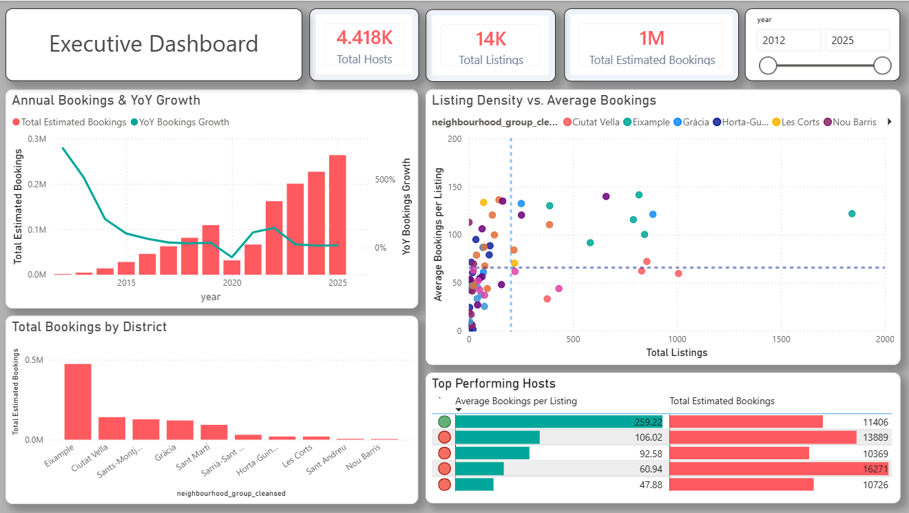
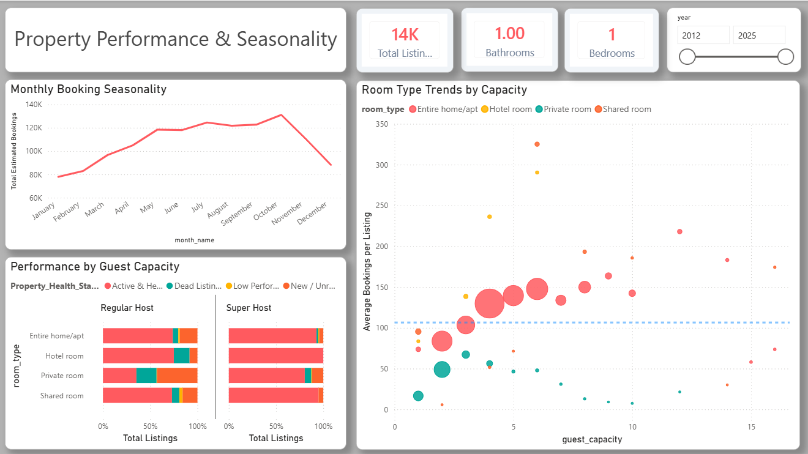

# 🏘️ Barcelona Airbnb: End-to-End Market Analytics & Data Engineering Pipeline

## 📌 Project Overview
This project is an end-to-end data engineering and analytics pipeline designed to process, model, and analyze 13 years of short-term rental market data from Airbnb Barcelona. The primary objective is to transform raw, highly fragmented datasets into a clean data warehouse architecture and an interactive Executive Dashboard that uncovers temporal trends, host consolidation, and asset performance.

## 📊 Executive Dashboard Analytics
The final analytical presentation layer delivers interactive business intelligence directly to stakeholders:


* **Executive Summary:** Tracks high-level KPIs (Total Hosts, Listings, and Bookings), highlighting a significant historical growth phase peaking around 2021–2022.
* **Listing Density vs. Average Bookings:** Features a crosshair threshold scatter plot to instantly isolate market outliers—identifying neighborhoods with high property counts but low booking velocity.


* **Monthly Booking Seasonality:** Isolates tourism peaks (May–October) against winter drops, enabling data-driven dynamic pricing insights.
* **Four-Dimensional Bubble Analysis:** Tracks guest capacity, room type, booking volume, and average booking performance simultaneously within a single visual engine.

---

## 🛠️ Tech Stack & Tools
* **Languages:** Python (Pandas, NumPy), T-SQL
* **Database Engine:** Microsoft SQL Server
* **Visualization & Analytics:** Power BI (Desktop), Plotly (Python)
* **Methodology:** Dimensional Modeling (Star Schema), Agile Post-Mortem Auditing

---

## 🏗️ Pipeline Architecture & Folder Structure

The repository files are systematically organized into sequential stages reflecting a true data engineering lifecycle:

```text
├── 01_data_preprocessing/      # Raw Data Preprocessing & Python EDA
│   ├── clean_calendar.ipynb
│   ├── cleaned_listings.ipynb
│   └── cleaned_reviews.ipynb
├── 02_data_warehouse/          # Core Database Architecture & Schema Creation
│   ├── 01_airbnb_schema.sql
│   ├── 02_bulk_load_warehouse.sql
│   ├── 03_generate_date_dimension.sql
│   └── schema_upgrades_and_composite_key_fixes.sql
├── 03_analytics_and_eda/       # Downstream Analytical Views & Advanced SQL
│   ├── 01_Exploratory_Data_Analysis.ipynb
│   └── 02_Advanced SQL EDA.sql
├── assets/                     # Dashboard Screen Captures & Visual Artifacts
│   ├── dashboard_part1.png
│   └── dashboard_part2.png
├── .gitignore
├── .gitattributes
└── README.md
```

### Phase 1: Python ETL & Exploratory Data Analysis (`01_data_preprocessing/`)
* **Data Wrangling:** Cleaned data structures, managed missing fields, and cast foundational datatypes in Pandas.
* **Visual Profiling:** Built interactive Plotly box plots to detect extreme outliers in property pricing, establishing baseline filters for the downstream database engine.
* **Relational Flattening:** Parsed, exploded, and melted unstructured components (such as amenities) to isolate granular dimensions.

### Phase 2: Enterprise Database Architecture (`02_data_warehouse/`)
* **Schema Enforcement:** Deployed DDL scripts creating a relational layout while upgrading key indices to `BIGINT` to proactively prevent numerical overflow errors.
* **Bulk Loading:** Managed high-volume native bulk insert operations to translate Pandas outputs straight into Microsoft SQL Server.
* **Dynamic Time Intelligence:** Programmed a T-SQL stored procedure generating a continuous 20-year date reference matrix, bypassing reliance on external static lookup datasets.

### Phase 3: Analytical Modeling & Feature Engineering (`03_analytics_and_eda/`)
* **Algorithmic Churn Engine:** Designed an advanced Common Table Expression (CTE) utilizing timestamp delta gaps (`DATEDIFF`) to calculate historical listing activity, classifying assets dynamically into distinct operational health buckets.
* **Business Logic Proxies:** Due to a lack of explicit financial transactional figures or explicit user reviews scores, engineered an analytical proxy using review dates—applying a 70% review-to-booking baseline formula to accurately simulate historical market revenue floors.

---

## 🛠️ Project Post-Mortem & Architectural Retrospective

This project served as an intensive learning laboratory. While the final reporting engine outputs flawless visual assets, navigating the construction process exposed critical architectural bottlenecks. Below is an autopsy of the structural mistakes made and the lessons applied:

### 1. Data Profiling Failure vs. Blind Execution
*   **The Mistake:** I invested substantial processing overhead cleaning a 6-million-row calendar dataset without first mapping its historical constraints against the primary review timeline. It ultimately revealed a tight 2-year window that misaligned with the broader 13-year project scope, making it completely redundant.
*   **The Lesson:** Never spend engineering energy writing ETL components before executing a complete chronological and structural profile of the raw ingestion source.

### 2. The Over-Normalization Relational Trap
*   **The Mistake:** I aggressively over-normalized the backend datasets, splitting three flat files into eight heavily fragmented tables via rigid DDL constraints. While highly efficient for traditional transaction logging (3NF), it introduced unnecessary data-model complexity and heavy join penalties when swallowed by Power BI's internal VertiPaq engine.
*   **The Lesson:** Analytical engines perform optimal columnar scanning when consuming wide, denormalized dimensions arranged in a flattened **Star Schema**, rather than highly normalized transactional architectures.

### 3. Static Assumptions on Time-Variant Attributes
*   **The Mistake:** Advanced SQL revenue formulas initially treated room pricing and minimum stay policies as immutable constants, entirely ignoring real-world market inflation, local seasonality shifts, and price elasticity over time.
*   **The Lesson:** Historical financial reporting models must incorporate **Slowly Changing Dimension (SCD Type 2)** architectures to properly capture snapshot-in-time metrics instead of evaluating historical records against current data definitions.
